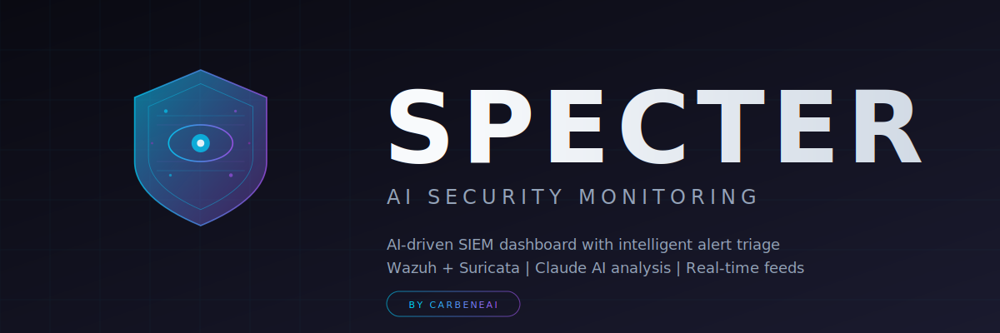
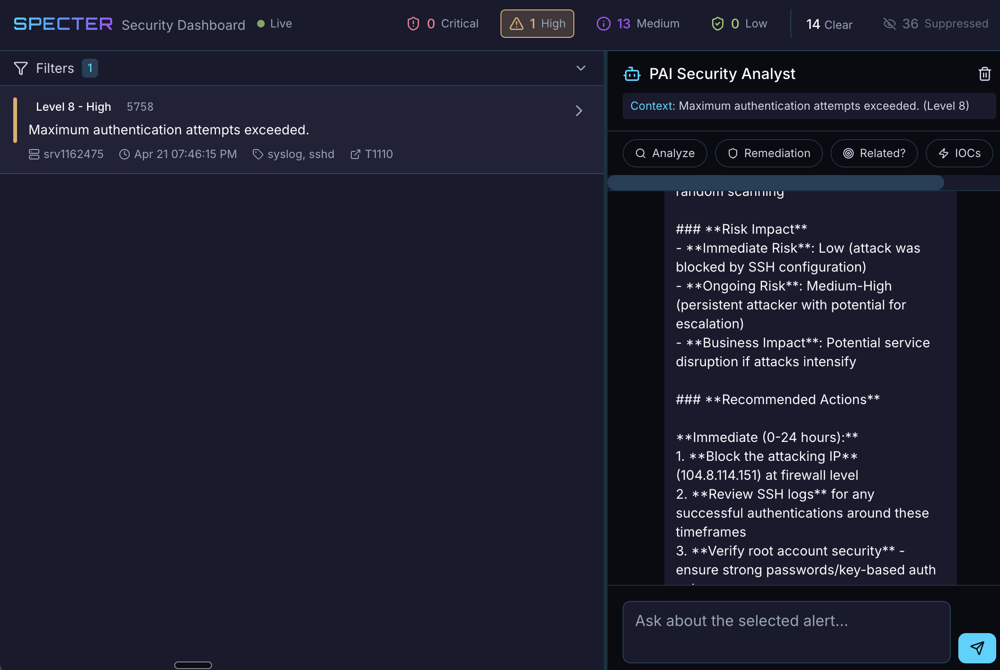
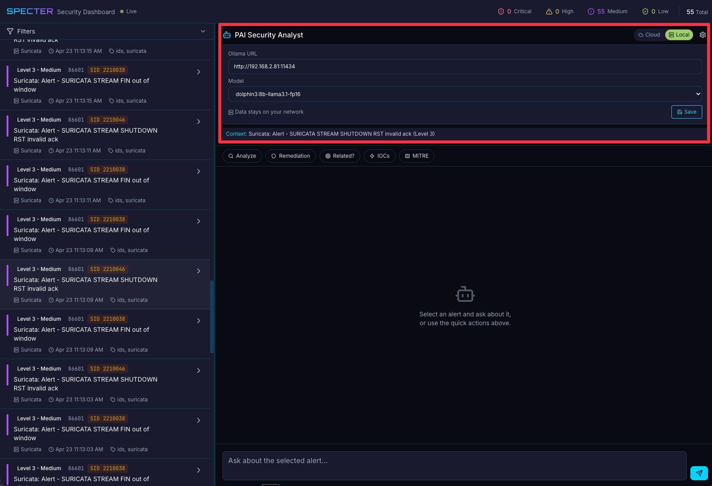
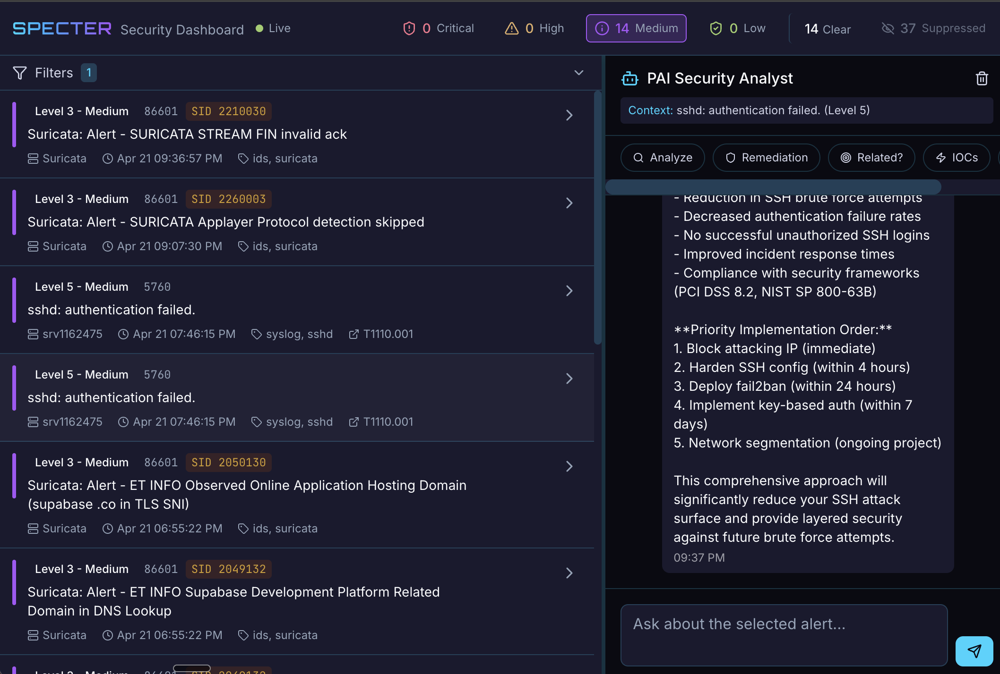
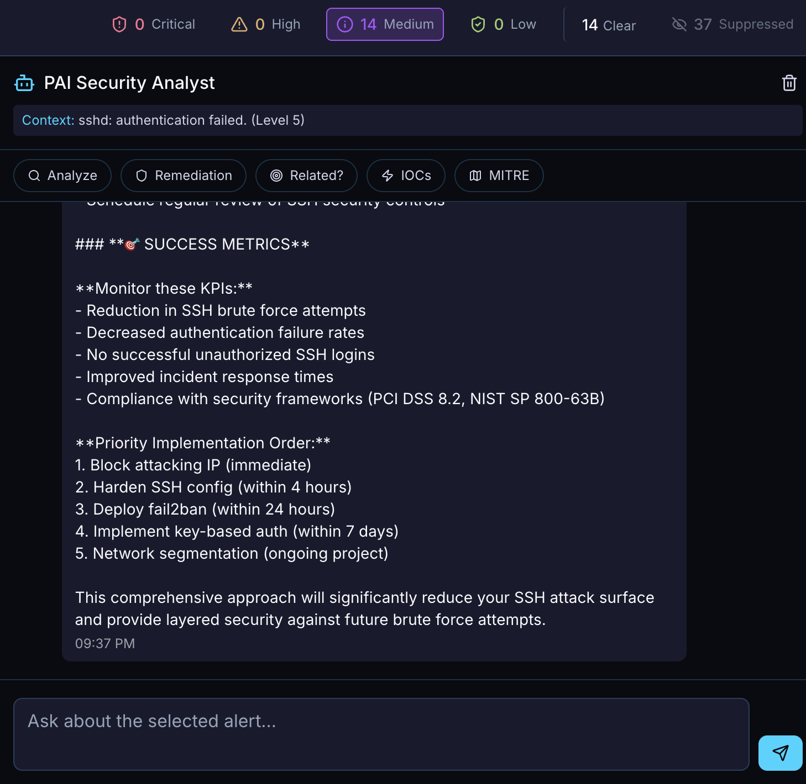
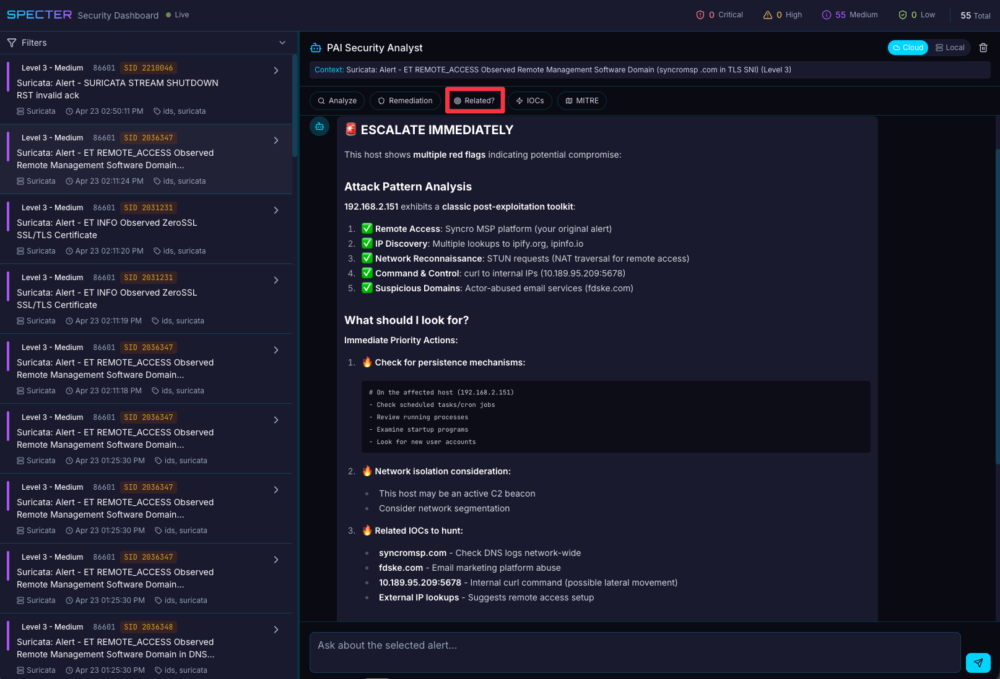
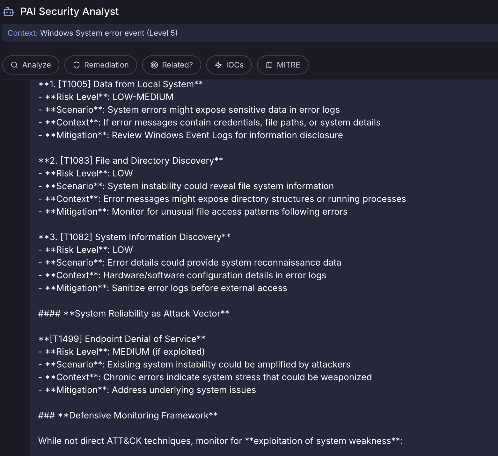
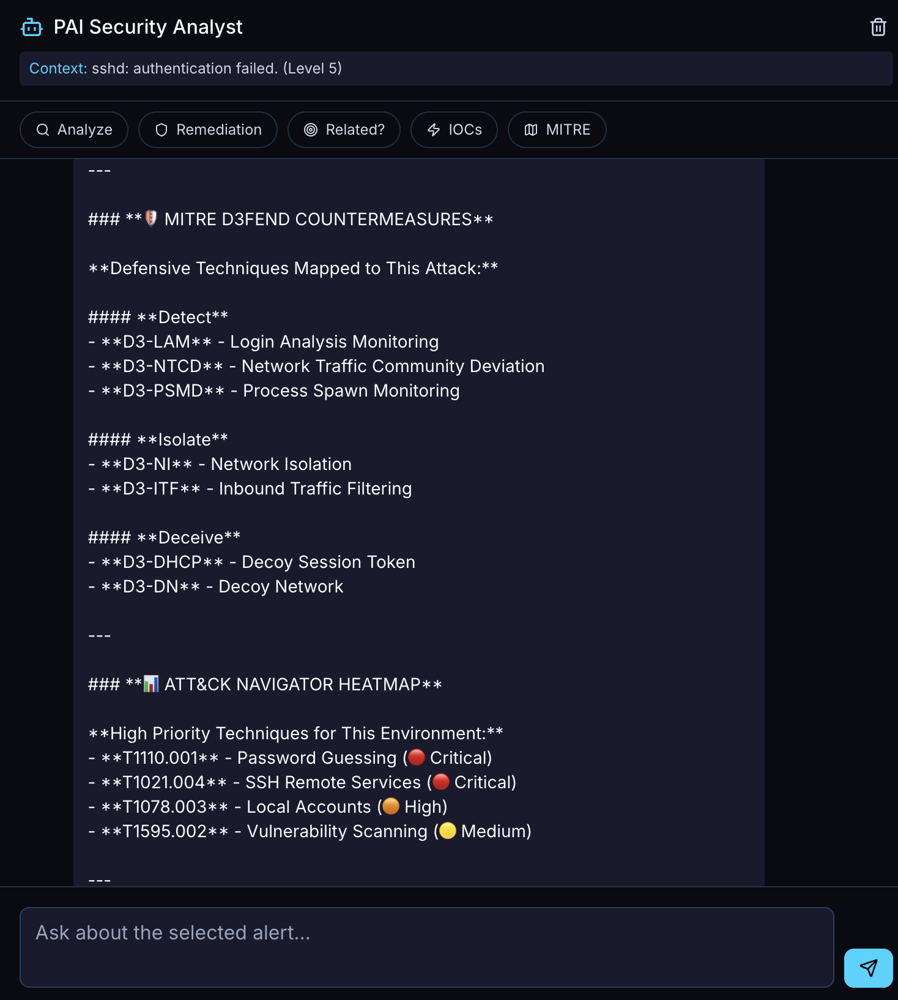
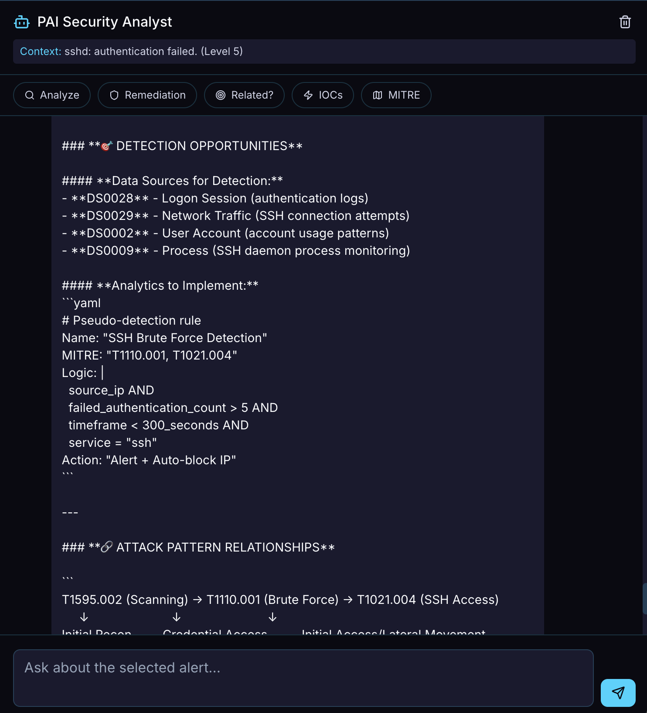

<p align="center">
  
</p>

# Specter

**Real-Time SIEM Dashboard with AI-Powered Alert Analysis**

[](LICENSE)
[](https://bun.sh)
[](https://vuejs.org)

Specter is a real-time security dashboard that connects to your Wazuh SIEM and Suricata IDS. It streams live alerts with severity-based color coding and includes an AI chat panel (Claude) that can autonomously search your historical alerts to provide context-aware threat analysis.

## Features

- **Live Alert Streaming** - WebSocket-based real-time alert feed from Wazuh Indexer (polls every 30s)
- **Severity Color Coding** - CarbeneAI dark theme with Critical/High/Medium/Low visual hierarchy
- **AI Security Analyst** - AI-powered chat that autonomously searches Wazuh for historical context
- **Cloud/Local AI Toggle** - Switch between Anthropic Claude (cloud) and Ollama (local) with one click. Keep sensitive SIEM data on your network.
- **Analyst Guidance Mode** - AI responses are structured to mentor junior analysts: What is this? Why does it matter? How do I know? What do I do next? What should I watch for?
- **Markdown Rendering** - AI responses render with full markdown: headers, bold, code blocks, lists, and blockquotes via marked.js
- **Alert Suppression** - Suppress noisy Suricata SIDs or Wazuh rules directly from the UI
- **Alert Filtering** - Filter by severity, agent, and rule group
- **Resizable Split-Screen** - Drag to resize the alert feed and chat panel
- **MITRE ATT&CK Mapping** - Full attack chain mapping with technique IDs, detection opportunities, and ATT&CK Navigator heatmaps
- **MITRE D3FEND Countermeasures** - Defensive technique recommendations mapped to detected threats (Detect, Isolate, Deceive)
- **Compliance Tags** - PCI DSS, HIPAA, GDPR, NIST 800-53 tags on alerts
- **HTTP Ingest** - Accept alerts via POST endpoint (useful with n8n webhooks)

## Screenshots

### Dashboard Overview
Live alert feed with severity color coding, alert suppression, and the AI chat panel.



### Cloud/Local AI Toggle
Switch between Anthropic Claude (cloud) and Ollama (local) with one click. Configure your Ollama URL and model in the settings panel. Data stays on your network.



### AI-Powered Analysis
The AI walks analysts through structured triage: What is this? Why does it matter? How do I know? Markdown rendering with headers, code blocks, and formatted lists.



### AI Remediation
Prioritized remediation steps with exact commands, compliance references, and escalation guidance.



### IOC Analysis
Indicator of compromise extraction with severity-based escalation and attack pattern identification.



### MITRE ATT&CK Mapping
Complete attack chain mapping with technique identification, tactic classification, and detection opportunities.



### MITRE D3FEND Countermeasures
Defensive technique recommendations mapped to detected threats, including detection, isolation, and deception strategies with ATT&CK Navigator heatmaps.



### Detection Opportunities
Data source identification, pseudo-detection rule generation, and attack pattern relationship mapping.



## Tech Stack

| Component | Technology |
|-----------|-----------|
| Runtime | Bun |
| Frontend | Vue 3 + Vite + Tailwind CSS |
| Backend | Bun HTTP + WebSocket server |
| AI | Anthropic Claude API (tool use) or Ollama (local) |
| Theme | CarbeneAI dark (cyan/purple) |
| Icons | Lucide Vue |

## Requirements

- [Bun](https://bun.sh) v1.0+
- Wazuh SIEM instance (self-hosted)
- [Anthropic API key](https://console.anthropic.com) (for cloud AI chat) **or** [Ollama](https://ollama.com) (for local AI)
- SSH access to Suricata/Wazuh hosts (optional, for rule suppression)

## Quick Start

### 1. Clone the repository

```bash
git clone https://github.com/CarbeneAI/Specter.git
cd Specter
```

### 2. Configure environment

```bash
cp .env.example .env
```

Edit `.env` and set at minimum:

```bash
WAZUH_DASHBOARD_URL=https://your-wazuh-server
WAZUH_DASHBOARD_PASSWORD=your-admin-password
ANTHROPIC_API_KEY=sk-ant-...
```

### 3. Install dependencies

```bash
cd apps/server && bun install
cd ../client && bun install
cd ../..
```

### 4. Start Specter

```bash
./manage.sh start
```

Open http://localhost:5173

## Configuration

See [docs/setup.md](docs/setup.md) for complete setup instructions including:
- Connecting to your Wazuh instance
- Configuring SSH for rule suppression
- Setting up as a systemd service
- Production deployment behind a reverse proxy

## How AI Analysis Works

When you click an alert and use the chat panel:

1. The selected alert is included as context in the system prompt
2. The AI structures responses to guide analyst thinking (What/Why/How/Next/Watch)
3. Claude can call `search_wazuh_alerts` tool to query your Wazuh Indexer for historical data (cloud mode)
4. Up to 3 tool call iterations for deep correlation
5. Quick actions: Analyze, Remediation, Related alerts, IOCs, MITRE ATT&CK/D3FEND mapping

### Cloud vs Local AI

Use the **Cloud/Local toggle** in the chat panel header to switch providers:

| | Cloud (Anthropic) | Local (Ollama) |
|---|---|---|
| **Model** | Claude Sonnet | Any Ollama model (llama3.1, gemma4, etc.) |
| **Data privacy** | Sent to Anthropic API | Stays on your network |
| **Wazuh search** | Autonomous tool use | Not available |
| **Speed** | Fast | Depends on model size and hardware |
| **Cost** | API usage fees | Free (your hardware) |

**Ollama setup**: Click the gear icon when Local is selected to configure the Ollama URL and select a model. Settings persist across sessions. Smaller models (8B) respond in seconds; larger models (30B+) may take over a minute.

## Alert Suppression

Two suppression mechanisms:

- **Suricata SID**: Updates `disable.conf` via SCP, runs `suricata-update`, reloads rules
- **Wazuh Rule**: Adds `level="0" overwrite="yes"` to `local_rules.xml`, restarts Wazuh manager

Requires `SURICATA_SSH_HOST` and `WAZUH_SSH_HOST` env vars with SSH key auth configured.

## API Reference

| Method | Endpoint | Description |
|--------|----------|-------------|
| GET | `/health` | Health check |
| GET | `/alerts/recent?limit=100` | Recent alerts |
| GET | `/alerts/stats` | Counts by severity |
| GET | `/alerts/filter?severities=critical,high` | Filtered alerts |
| POST | `/alerts/ingest` | Ingest alert(s) via HTTP |
| POST | `/chat` | AI chat message |
| GET | `/chat/prompts` | Quick prompt templates |
| POST | `/alerts/search` | Search Wazuh Indexer |
| POST | `/alerts/suppress` | Suppress a rule |
| GET | `/alerts/suppressed` | List suppressed rules |
| GET | `/settings/ollama-models?ollamaUrl=...` | List available Ollama models |
| WS | `/stream` | Real-time alert stream |

## Manage Script

```bash
./manage.sh start    # Start dashboard
./manage.sh stop     # Stop dashboard
./manage.sh restart  # Restart
./manage.sh status   # Check if running
./manage.sh logs     # View recent logs
```

## Running as a Service

See [docs/deployment.md](docs/deployment.md) for systemd service setup.

## Companion Tools

- **[OhMyPCAP](https://github.com/dougburks/ohmypcap)** — Standalone PCAP analyzer by Doug Burks (Security Onion). Pairs naturally with Specter: when an alert needs packet-level investigation, drop the PCAP into OhMyPCAP for Suricata alerts, flow/DNS/HTTP/TLS metadata, ASCII transcripts, hexdumps, and stream carving. Self-host with the [docker-compose manifest in homelab-deploy/ohmypcap/](https://github.com/CarbeneAI/PAI/tree/main/homelab-deploy/ohmypcap), or try the public demo at [securityonion.net/pcap](https://securityonion.net/pcap).

### PCAP Download from Suricata Alerts

Hover any Suricata alert row → click the **download (FileDown) icon** in the action gutter. A panel pops up with a copy-paste shell command that:

1. SSHes to the Suricata host
2. Locates the rotating PCAP file matching the alert's timestamp
3. Carves only the alert's flow (BPF: `host SRC and host DST`)
4. Streams the resulting `.pcap` straight to `~/Downloads/alert-<flow_id>.pcap` on your laptop

Drop that file into [OhMyPCAP](https://pcap.home.carbeneai.com) for full analysis.

**Requires:** Suricata's `pcap-log` output enabled with `conditional: alerts` and `mode: normal` (uncompressed). The button only appears for Suricata alerts where `srcip` and `dstip` are populated. Override the SSH target with `VITE_PCAP_SSH=user@host` at build time.

## Roadmap

Specter currently analyzes and explains alerts. The next phase is autonomous response.

### AI Auto-Triage

Automatically classify incoming alerts by severity and urgency. Filter noise so analysts only see what matters. Correlate related alerts into incidents instead of showing individual events.

### Remediation Recommendations

For each alert, generate actionable remediation steps specific to your environment — not generic advice, but commands you can run, configs you can change, and rules you can deploy.

### One-Click Remediation

Execute AI-recommended fixes directly from the dashboard with user approval. SSH brute force detected? One click to block the IP, harden SSH config, and verify fail2ban is active.

### Autonomous Response

For trusted alert patterns with known-safe remediations, let the AI act without waiting for approval — then notify you after. A SOC analyst that never sleeps and never gets alert fatigue.

> **This isn't hypothetical.** The autonomous response workflow has already been tested manually — Suricata detected 1,500+ SSH brute force attempts against a production server, and Claude Code responded by hardening SSH configuration, verifying fail2ban was active, adding firewall rules, and whitelisting trusted IPs. The entire incident was handled in a single AI conversation. Specter's roadmap is about packaging that capability into the dashboard.

## Contributing

Pull requests welcome. Please open an issue first to discuss major changes.

## License

MIT - see [LICENSE](LICENSE)

---

Built by [CarbeneAI](https://carbene.ai)
