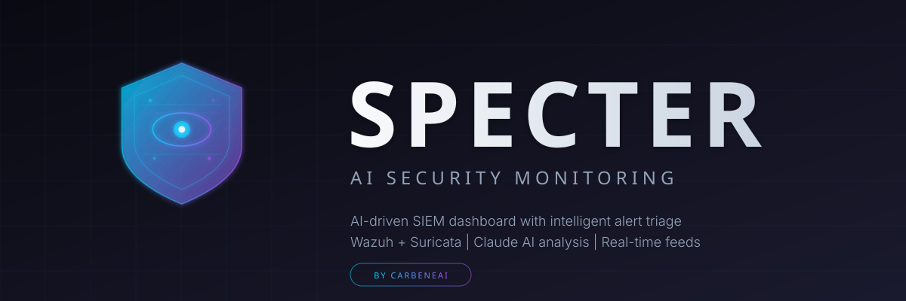
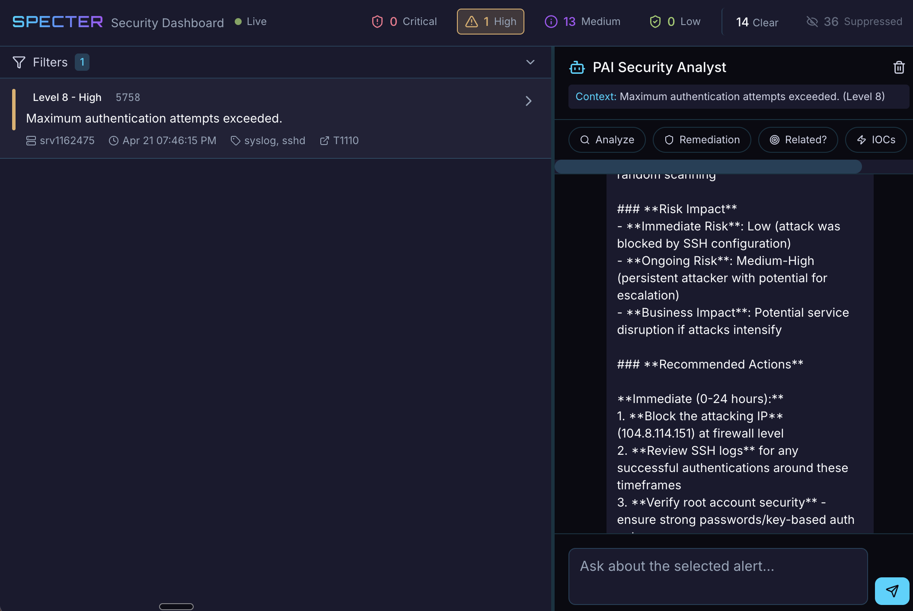
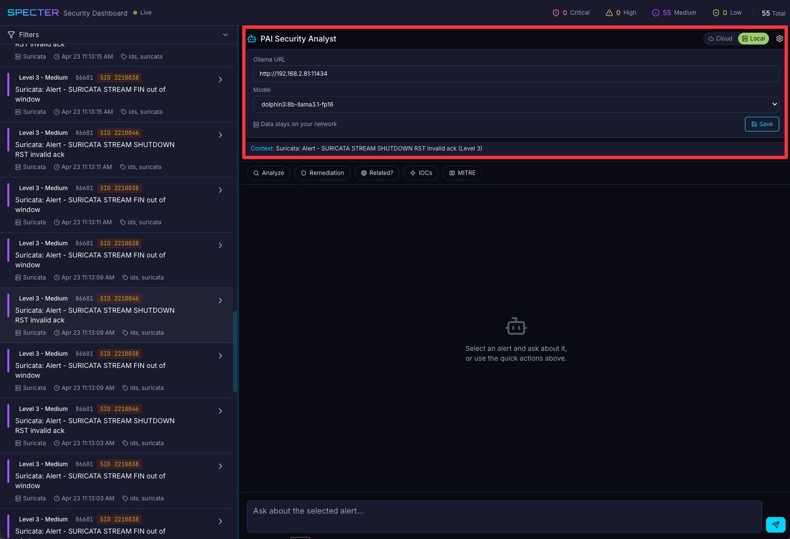
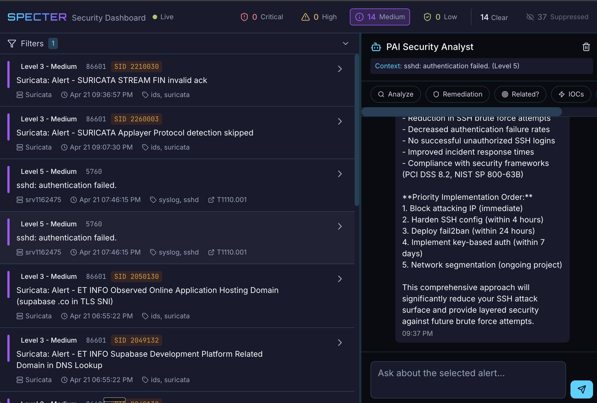
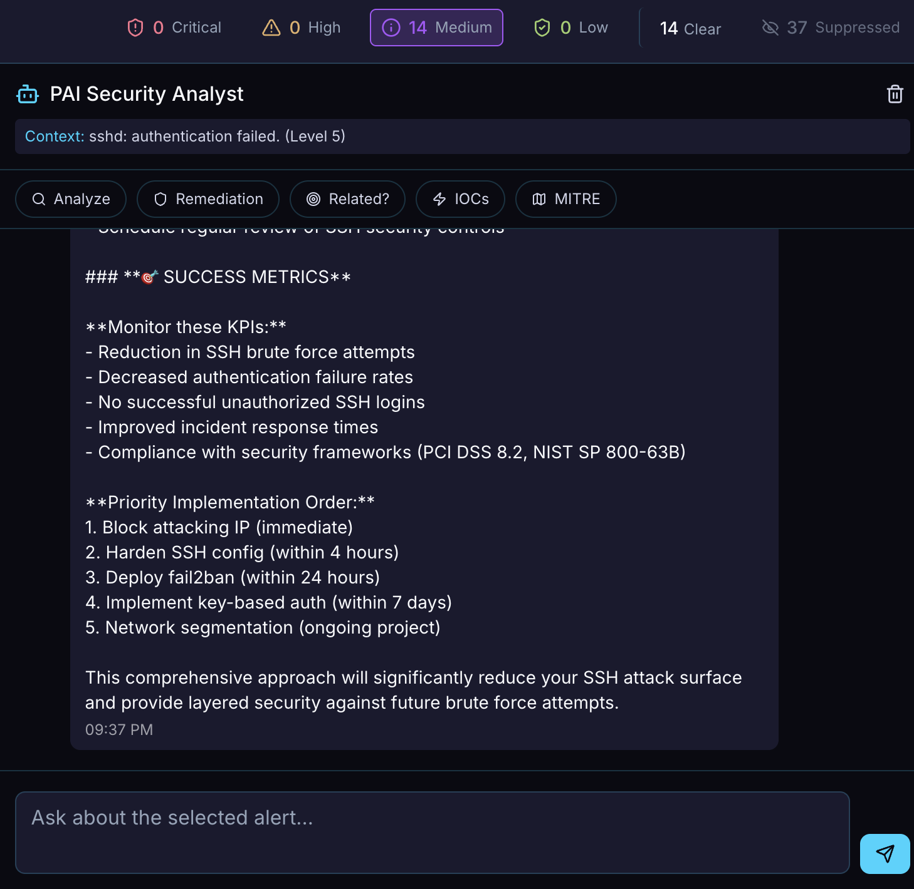
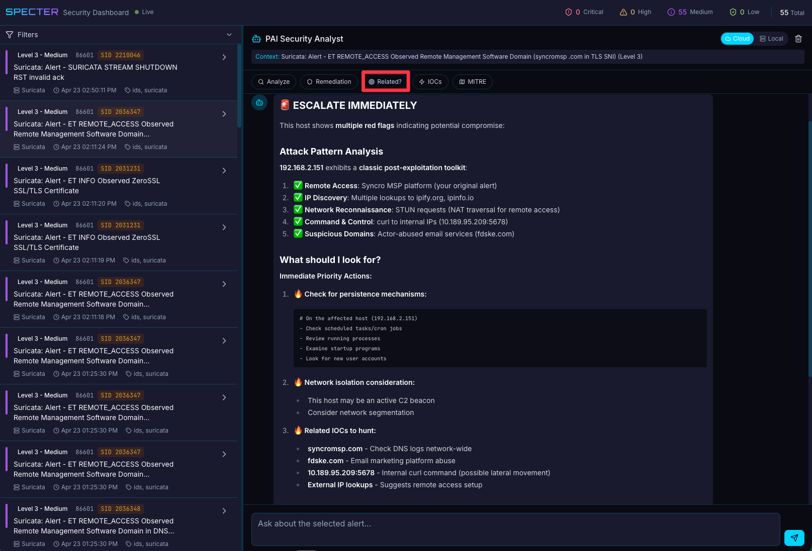
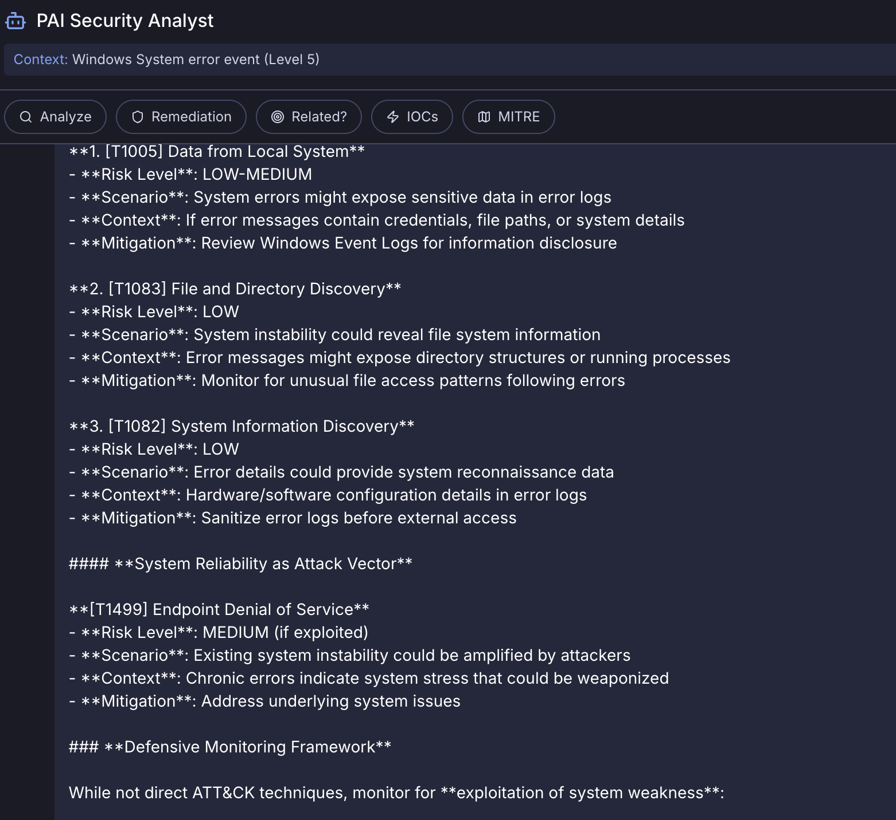
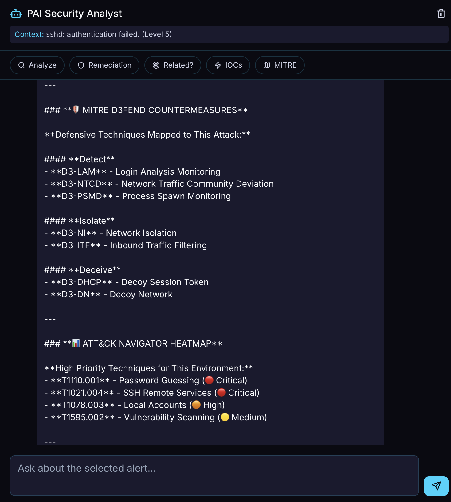
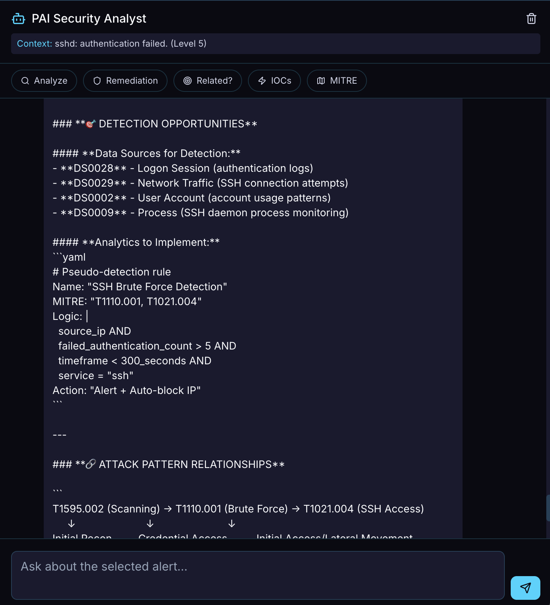

<p align="center">
  
</p>

# Specter

**Real-Time SIEM Dashboard with AI-Powered Alert Analysis**

[](LICENSE)
[](https://bun.sh)
[](https://vuejs.org)

Specter is a real-time security dashboard that connects to your Wazuh SIEM and Suricata IDS. It streams live alerts with severity-based color coding and includes an AI chat panel (Claude) that can autonomously search your historical alerts to provide context-aware threat analysis.

## About CarbeneAI

Specter is one of four open-source security tools published by CarbeneAI, alongside [Harbinger](https://github.com/CarbeneAI/Harbinger) (AI threat intel), [Talon](https://github.com/CarbeneAI/Talon) (AI-assisted offensive workflows), and [Forge](https://github.com/CarbeneAI/Forge) (AI operations platform).

CarbeneAI builds open-source tooling for security operations and teaches practitioners to build their own. These repos are the working reference.

Use this repo. Fork it. Improve it. More at [carbene.ai](https://carbene.ai)

## Features

- **Deterministic Scorer** - Rules-only pre-triage that scores every alert 0-100 and bands it critical/high/medium/low/noise *before* any LLM is called. No API key, no network call, so it keeps working when the AI chat is unconfigured. Every weight lives in one documented constant.
- **Investigation Ledger** - Every AI investigation persisted as a replayable record: system prompt, each tool call and its result, final analysis, token counts, timing. Addressable by permalink. The receipt that makes autonomous response auditable after the fact.
- **Live Alert Streaming** - WebSocket-based real-time alert feed from Wazuh Indexer (polls every 30s)
- **Severity Color Coding** - CarbeneAI dark theme with Critical/High/Medium/Low visual hierarchy
- **AI Security Analyst** - AI-powered chat that autonomously searches Wazuh for historical context
- **Cloud/Local AI Toggle** - Switch between Anthropic Claude (cloud) and Ollama (local) with one click. Keep sensitive SIEM data on your network.
- **Analyst Guidance Mode** - AI responses are structured to mentor junior analysts: What is this? Why does it matter? How do I know? What do I do next? What should I watch for?
- **Markdown Rendering** - AI responses render with full markdown: headers, bold, code blocks, lists, and blockquotes via marked.js
- **Alert Suppression** - Suppress noisy Suricata SIDs or Wazuh rules directly from the UI
- **Alert Filtering** - Filter by severity, agent, and rule group
- **Resizable Split-Screen** - Drag to resize the alert feed and chat panel
- **MITRE ATT&CK Mapping** - Full attack chain mapping with technique IDs, detection opportunities, and ATT&CK Navigator heatmaps
- **MITRE D3FEND Countermeasures** - Defensive technique recommendations mapped to detected threats (Detect, Isolate, Deceive)
- **Compliance Tags** - PCI DSS, HIPAA, GDPR, NIST 800-53 tags on alerts
- **HTTP Ingest** - Accept alerts via POST endpoint (useful with n8n webhooks)

## Screenshots

### Dashboard Overview
Live alert feed with severity color coding, alert suppression, and the AI chat panel.



### Cloud/Local AI Toggle
Switch between Anthropic Claude (cloud) and Ollama (local) with one click. Configure your Ollama URL and model in the settings panel. Data stays on your network.



### AI-Powered Analysis
The AI walks analysts through structured triage: What is this? Why does it matter? How do I know? Markdown rendering with headers, code blocks, and formatted lists.



### AI Remediation
Prioritized remediation steps with exact commands, compliance references, and escalation guidance.



### IOC Analysis
Indicator of compromise extraction with severity-based escalation and attack pattern identification.



### MITRE ATT&CK Mapping
Complete attack chain mapping with technique identification, tactic classification, and detection opportunities.



### MITRE D3FEND Countermeasures
Defensive technique recommendations mapped to detected threats, including detection, isolation, and deception strategies with ATT&CK Navigator heatmaps.



### Detection Opportunities
Data source identification, pseudo-detection rule generation, and attack pattern relationship mapping.



## Tech Stack

| Component | Technology |
|-----------|-----------|
| Runtime | Bun |
| Frontend | Vue 3 + Vite + Tailwind CSS |
| Backend | Bun HTTP + WebSocket server |
| AI | Claude CLI over SSH (default), Ollama (local), or Anthropic API |
| Theme | CarbeneAI dark (cyan/purple) |
| Icons | Lucide Vue |

## Requirements

- [Bun](https://bun.sh) v1.0+
- Wazuh SIEM instance (self-hosted)
- Claude Max on a Mac Studio reachable over SSH (default triage), **or** [Ollama](https://ollama.com) (local), **or** an [Anthropic API key](https://console.anthropic.com) with credits (`TRIAGE_PROVIDER=anthropic`)
- SSH access to Suricata/Wazuh hosts (optional, for rule suppression)

## Quick Start

### 1. Clone the repository

```bash
git clone https://github.com/CarbeneAI/Specter.git
cd Specter
```

### 2. Configure environment

```bash
cp .env.example .env
```

Edit `.env` and set at minimum:

```bash
WAZUH_DASHBOARD_URL=https://your-wazuh-server
WAZUH_DASHBOARD_PASSWORD=your-admin-password
TRIAGE_PROVIDER=claude
# CLAUDE_CLI_SSH_HOST=user@mac-studio
# Optional: historical correlation during triage (see below). Both are required
# together; unset means triage runs without alert history.
# QUERY_INDEXER_PATH=/abs/path/on/the/ssh/host/QueryIndexer.ts
# QUERY_INDEXER_ENV=~/path/to/env-file-holding-WAZUH_DASHBOARD_PASSWORD
# Optional local fallback:
# OLLAMA_URL=http://localhost:11434
# OLLAMA_MODEL=gemma4:31b
```

`TRIAGE_PROVIDER=claude` (the default) does **not** call `api.anthropic.com`. It sshes to the Studio and runs `claude -p` on the existing Claude Max subscription. Set `TRIAGE_PROVIDER=anthropic` only if you intentionally want the paid Messages API (requires `ANTHROPIC_API_KEY` with a non-zero balance).

### 3. Install dependencies

```bash
cd apps/server && bun install
cd ../client && bun install
cd ../..
```

### 4. Start Specter

```bash
./manage.sh start
```

Open http://localhost:5173

## Configuration

See [docs/setup.md](docs/setup.md) for complete setup instructions including:
- Connecting to your Wazuh instance
- Configuring SSH for rule suppression
- Setting up as a systemd service
- Production deployment behind a reverse proxy

## Deterministic Scoring

Every alert is scored before the LLM is ever consulted. This is deliberate: LLM calls cost money and latency, and most alerts don't need one. The scorer is pure, has no dependencies, reads no secrets, and makes no network calls.

Signals, all in `SCORER_WEIGHTS` in [apps/server/src/scorer.ts](apps/server/src/scorer.ts):

| Signal | Effect | Reasoning |
|---|---|---|
| Wazuh `rule.level` | +10 to +90 | Dominant signal. Rule authors already tuned severity; start there rather than re-deriving it. |
| MITRE ATT&CK mapping present | +10 | The rule was vetted against real adversary behavior. Absence is never a penalty, only less enrichment. |
| High frequency, same srcip + rule | -40 | Alert fatigue, not an incident. Flat penalty so one very noisy source can't swing the score further than a merely noisy one. |
| Rule group in `SUPPRESSED_GROUPS` | -20 | Already-classified routine noise. |

The frequency downweight **only fires on low and medium severity**. A repeating critical or high alert is an active incident, not noise, and frequency alone must never demote it. That gate is the kind of thing that is obvious in hindsight and expensive to learn in production.

Swap in your own model by implementing `ScoringBackend` and calling `registerScoringBackend()` once at startup. No other call site changes.

## Investigation Ledger

Specter's AI chat used to be ephemeral: the reasoning, the evidence, and the tool calls vanished when the tab closed. The ledger persists each investigation to SQLite (`bun:sqlite`, no new dependency) as an ordered sequence of steps, replayable at `/ledger/:id`.

It records the system prompt, every tool call with its arguments and result, the final analysis, model, token usage, and duration. `sk-ant-` patterns are scrubbed before insert as defense in depth. All queries are parameterized; the `:id` route validates UUID shape by regex before SQLite is touched at all.

Ledger writes are fail-open: a SQLite failure logs and is swallowed, never breaking the chat response. Only the Anthropic path is recorded, because the Ollama path has no tool-use loop and therefore no multi-step investigation to reconstruct.

This is the part that matters for autonomous response later. An action a machine took without asking is only defensible if you can reconstruct why it took it.

Full design, schema, and testing strategy: [docs/architecture-scorer-ledger.md](docs/architecture-scorer-ledger.md).

## How AI Analysis Works

When you click an alert and use the chat panel:

1. The selected alert is included as context in the system prompt
2. **Specter runs a read-only historical lookup itself** and injects the result
   into the prompt, so the model already knows whether this alert is new or
   recurring before it starts reasoning (see below)
3. The AI structures responses to guide analyst thinking (What/Why/How/Next/Watch)
4. With `TRIAGE_PROVIDER=anthropic`, Claude can additionally call
   `search_wazuh_alerts` as a tool, with up to 3 iterations. The `claude` CLI
   path and Ollama do not use tools — they get the history injected instead.
5. Quick actions: Analyze, Remediation, Related alerts, IOCs, MITRE ATT&CK/D3FEND mapping

### Historical correlation

Set `QUERY_INDEXER_PATH` and `QUERY_INDEXER_ENV` to enable it. Before each
triage, Specter runs a read-only `_search`/`_count` query on the ssh host and
puts the result in the system prompt:

```
full history: 3458 alert(s) across 65 distinct day(s)
  first seen: 2025-12-20  last seen: 2026-09-17
  VERDICT: RECURRING. Stale noise or an unremediated gap, not a new event.
```

**Why the server runs this instead of granting the model a shell.** The
`claude` CLI path passes `--disallowedTools Bash Edit Write Read WebSearch
WebFetch`, so the model has no shell by design, and it used to answer *"this
session doesn't have a local shell/Bash tool available"* when asked for
history. Granting a scoped `--allowedTools 'Bash(...)'` was tried and reverted:
that flag is variadic, so the scope did not hold and a denial test had the
model run `whoami && ls ~/.ssh` on the ssh host. Wazuh alert text is
attacker-influenced, so a shell there is not an acceptable default.

Running the lookup server-side is also simply better: the history is
**deterministic** — always present, never dependent on the model choosing to
ask, which matters for unattended scheduled triage — and it adds no attack
surface. Rule IDs must match `^\d{1,10}$` and agent IPs a dotted quad before
they reach the shell. A failed lookup renders *"historical lookup unavailable"*
so the model cannot imply it checked.

Read the verdict from **full retained history, not the `--days` window**: a
short window or a sensor outage makes a long-running alert look brand new.

### Triage providers (`TRIAGE_PROVIDER`)

Server-side switch in `.env`. The chat panel **Local** toggle still forces Ollama; **Cloud** uses whatever `TRIAGE_PROVIDER` selects.

| Provider | Backend | Cost | Notes |
|---|---|---|---|
| `claude` (default) | ssh + `claude -p` on Mac Studio | $0 marginal (Claude Max) | Falls back to Ollama on CLI/ssh failure. Never sets `ANTHROPIC_API_KEY` on the remote side. |
| `ollama` | Local Ollama `/api/chat` | Free (your hardware) | Bun `timeout: false` so slow 31B generations survive past 300s. |
| `anthropic` | Paid Messages API | API usage fees | Legacy path with Wazuh tool use + investigation ledger. |

**Ollama setup**: Click the gear icon when Local is selected to configure the Ollama URL and select a model. Settings persist across sessions. Smaller models (8B) respond in seconds; larger models (30B+) may take minutes.

## Muting vs Suppression

Two different things, deliberately kept apart.

### Muting (default, no SSH required)

A **mute** hides an alert in the Specter feed. The alert is still ingested,
still scored, still written to Wazuh, and still searchable for hunting. Nothing
on the sensor changes.

- Keyed on **rule ID + source IP**, so muting "Telegram SNI from my phone" does
  not mute the same signature coming from a server that has no business talking
  to Telegram. Tick "any source" in the dialog for a rule-wide mute.
- **Time-boxed**, 30 days by default (7 / 30 / 90 / never). An expired mute
  stops hiding immediately and the alerts resurface for review, so a SIEM can't
  quietly go dark because of a decision made months ago.
- Always visible: an amber strip above the feed states how many alerts are
  currently hidden and by how many mutes. Expanding it lists each mute with its
  reason and expiry, and unmutes in one click.
- Stored in `data/mutes.sqlite` (`MUTES_DB_PATH`), separate from the ledger DB.

Use this for known-good noise: your own Telegram, Tailscale DERP, SSDP from the
router.

### Suppression (upstream, requires SSH)

A **suppression** disables the signature at the source. The alert stops being
generated, so it is gone from Wazuh too — you lose it for hunting and for the
scorer's frequency signal.

- **Suricata SID**: updates `disable.conf` via SCP, runs `suricata-update`, reloads rules
- **Wazuh Rule**: adds `level="0" overwrite="yes"` to `local_rules.xml`, restarts Wazuh manager

Requires `SURICATA_SSH_HOST` and `WAZUH_SSH_HOST` with SSH key auth. If they are
unset, the suppress action returns
`SURICATA_SSH_HOST environment variable not configured` — that is by design, not
a bug. Prefer a mute unless the signature is genuinely worthless to you.

## Alert Grouping

The feed collapses alerts into **rule + source IP** groups by default (the same
key a mute uses, so "mute this group" means exactly what it says). One 24h window
on a live homelab was 15,101 alerts of which 2 were level 8+; grouped, that is a
few dozen rows.

- Collapsed rows show a count badge and the first-seen → last-seen span; expand
  to see every member.
- A group carries the **highest** rule level among its members, so one level-12
  alert inside thousands of ET INFO still renders as critical instead of hiding.
- A group of one renders as a plain alert row.
- The **Grouped / Flat** toggle above the feed switches back to the raw stream.

## API Reference

| Method | Endpoint | Description |
|--------|----------|-------------|
| GET | `/health` | Health check |
| GET | `/alerts/recent?limit=100` | Recent alerts |
| GET | `/alerts/stats` | Counts by severity |
| GET | `/alerts/filter?severities=critical,high` | Filtered alerts |
| GET | `/alerts/scored?band=noise&limit=100` | Scored alerts, optionally filtered by band |
| GET | `/ledger?limit=50` | List recent investigations |
| GET | `/ledger/:id` | Replay one investigation (UUID only) |
| POST | `/alerts/ingest` | Ingest alert(s) via HTTP |
| POST | `/chat` | AI chat message |
| GET | `/chat/prompts` | Quick prompt templates |
| POST | `/alerts/search` | Search Wazuh Indexer |
| POST | `/alerts/suppress` | Suppress a rule upstream (needs SSH) |
| GET | `/alerts/suppressed` | List suppressed rules |
| GET | `/alerts/mutes?includeExpired=1` | List mutes (active by default) |
| POST | `/alerts/mutes` | Create/refresh a mute (`ruleId`, `srcip`, `reason`, `ttlDays`) |
| DELETE | `/alerts/mutes` | Unmute (`ruleId`, `srcip`) |
| GET | `/settings/ollama-models?ollamaUrl=...` | List available Ollama models |
| WS | `/stream` | Real-time alert stream |

## Manage Script

```bash
./manage.sh start    # Start dashboard
./manage.sh stop     # Stop dashboard
./manage.sh restart  # Restart
./manage.sh status   # Check if running
./manage.sh logs     # View recent logs
```

## Running as a Service

See [docs/deployment.md](docs/deployment.md) for systemd service setup.

## Companion Tools

- **[OhMyPCAP](https://github.com/dougburks/ohmypcap)** — Standalone PCAP analyzer by Doug Burks (Security Onion). Pairs naturally with Specter: when an alert needs packet-level investigation, drop the PCAP into OhMyPCAP for Suricata alerts, flow/DNS/HTTP/TLS metadata, ASCII transcripts, hexdumps, and stream carving. Self-host with the [docker-compose manifest in homelab-deploy/ohmypcap/](https://github.com/CarbeneAI/PAI/tree/main/homelab-deploy/ohmypcap), or try the public demo at [securityonion.net/pcap](https://securityonion.net/pcap).

### PCAP Download from Suricata Alerts

Hover any Suricata alert row → click the **download (FileDown) icon** in the action gutter. A panel pops up with a copy-paste shell command that:

1. SSHes to the Suricata host
2. Locates the rotating PCAP file matching the alert's timestamp
3. Carves only the alert's flow (BPF: `host SRC and host DST`)
4. Streams the resulting `.pcap` straight to `~/Downloads/alert-<flow_id>.pcap` on your laptop

Drop that file into [OhMyPCAP](https://securityonion.net/pcap) for full analysis.

**Requires:** Suricata's `pcap-log` output enabled with `conditional: alerts` and `mode: normal` (uncompressed). The button only appears for Suricata alerts where `srcip` and `dstip` are populated. Override the SSH target with `VITE_PCAP_SSH=user@host` at build time.

## Roadmap

Specter currently analyzes and explains alerts. The next phase is autonomous response.

### AI Auto-Triage

Automatically classify incoming alerts by severity and urgency. Filter noise so analysts only see what matters. Correlate related alerts into incidents instead of showing individual events.

### Remediation Recommendations

For each alert, generate actionable remediation steps specific to your environment — not generic advice, but commands you can run, configs you can change, and rules you can deploy.

### One-Click Remediation

Execute AI-recommended fixes directly from the dashboard with user approval. SSH brute force detected? One click to block the IP, harden SSH config, and verify fail2ban is active.

### Autonomous Response

For trusted alert patterns with known-safe remediations, let the AI act without waiting for approval — then notify you after. A SOC analyst that never sleeps and never gets alert fatigue.

> **This isn't hypothetical.** The autonomous response workflow has already been tested manually. Suricata detected 1,500+ SSH brute force attempts against a production server, and Claude Code responded by hardening SSH configuration, verifying fail2ban was active, adding firewall rules, and whitelisting trusted IPs. The entire incident was handled in a single AI conversation. Specter's roadmap is about packaging that capability into the dashboard.

### Why the decision belongs on the endpoint

The architectural case for moving detection and response onto the agent, including the parts that break when you do and the parts that are not solved, is published in full at [endpoint-mesh](https://github.com/CarbeneAI/endpoint-mesh). No patents, no restrictions. Any open-source security project is free to implement it.

## Contributing

Pull requests welcome. Please open an issue first to discuss major changes.

## License

MIT - see [LICENSE](LICENSE)

---

Built by [CarbeneAI](https://carbene.ai)
